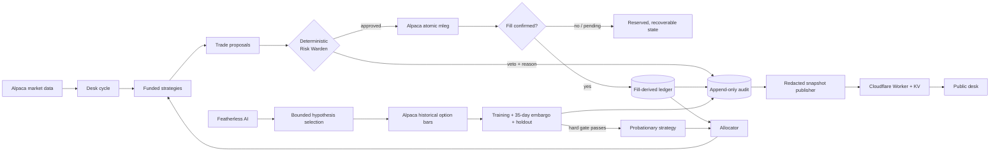

# Aperture

**An autonomous options desk that researches, hires, funds, and fires its own strategies.**

[Open the public desk](https://aperture-desk.kgotsonceba.workers.dev) · [Read the deployment runbook](DEPLOY.md)

> The public desk currently falls back to an unmistakably labeled demo scenario until the dedicated hackathon account begins publishing. Demo numbers are illustrative; the trading and research paths use Alpaca paper-trading data and orders.

Aperture is built for the [Alpaca AI Trading Agents Hackathon](https://lablab.ai/ai-hackathons/alpaca-ai-trading-agents-hackathon). It is not a chatbot wrapped around an order endpoint. It is a closed-loop desk:

1. strategies turn Alpaca market data into defined-risk option proposals;
2. deterministic code computes expiry payoff and can veto every proposal;
3. approved structures are submitted as atomic Alpaca multi-leg orders;
4. only confirmed fills enter the ledger and performance record;
5. realized evidence reallocates capital, while persistent failure removes it;
6. after the close, a research lab tests bounded mutations and can hire a new strategy only after an embargoed chronological holdout.

## The autonomy contract

| Component | Allowed to do | Explicitly cannot do |
|---|---|---|
| Featherless AI | Prioritize predeclared one-knob experiments; explain completed evidence | See backtest outcomes before selection; promote a candidate; place an order; change risk limits |
| Strategy roster | Form CARRY, CRUSH, DRIFT, and promoted-lab proposals | Bypass the Warden or spend outside its allocation |
| Research gate | Backtest real historical option bars; enforce holdout, minimum evidence, incumbent improvement, and a trials-aware threshold | Relax its own bar because a narrative sounds persuasive |
| Risk Warden | Compute worst-case payoff, size, veto, halt entries, and trigger flattening | Call an LLM or infer missing market data |
| Alpaca CLI | Read market/account state and submit idempotent `mleg` orders | Turn submission acceptance into a synthetic fill |
| Cloudflare Worker | Accept a redacted snapshot and serve the public evidence surface | Receive broker credentials or control trading |

The language model proposes. Code disposes.

## Architecture



### One trading cycle

The order of operations is part of the safety model:

1. reconcile the local ledger with broker positions and orders;
2. evaluate circuit breakers;
3. manage exits before considering entries;
4. allocate risk budget from fill-derived evidence;
5. collect proposals from funded strategies;
6. run every proposal through every Warden gate;
7. submit approved structures with deterministic client-order IDs;
8. poll parent orders and record only confirmed multi-leg fills;
9. publish a public-safe snapshot in a failure-isolated path.

A crash after order acceptance is recoverable: pending reservations retain the client-order identity, and the next cycle recovers the broker order before it can submit again.

## Strategy roster

- **CARRY** sells 10–16 delta iron condors on liquid index ETFs, with defined wings, a minimum credit-to-width floor, profit-taking, and a stop.
- **CRUSH** compares the option-implied earnings move with realized moves from prior reports. It sells a bounded condor when event premium is rich, buys a bounded strangle when it is unusually cheap, and usually does nothing.
- **DRIFT** expresses post-earnings under-reaction with a debit vertical rather than stock or naked options.
- **LAB hires** are executable versions of research candidates. A new hire starts on probation with 5% of the strategy risk budget; it is not merely a dashboard annotation.

The allocator uses realized return on risk with shrinkage toward designed priors. A few lucky trades cannot seize the book. Warden vetoes also count as calibration evidence, and firing stops new entries without abandoning exits on positions already open.

## Research that can say “no”

The research layer is intentionally harder to impress than it is to generate:

- Featherless sees a finite family of one-parameter mutations and no performance outcomes.
- Historical option bars are retrieved through Alpaca with complete pagination.
- The contract universe is derived from every selected geometry and every historically eligible spot session, mirroring the live ±12% chain band; candidates cannot disappear because of an arbitrary strike cap.
- Entries use only contracts that printed on that session.
- Training and untouched holdout windows are separated by a 35-day embargo.
- A candidate needs at least 10 trades, at least 6% return on risk, acceptable drawdown, a trials-adjusted t-statistic, and at least 3 percentage points of edge over the incumbent.
- One expiry counts as one opportunity, preventing early exits and re-entries from inflating the sample.

Nothing being promoted is a valid and expected result.

## Non-negotiable risk limits

All limits below are Python, not prompts:

| Gate | Limit |
|---|---:|
| Maximum expiry loss per trade | 4% of equity |
| Maximum expiry loss per underlying | 8% of equity |
| Total open maximum loss | 25% of equity |
| Daily loss entry halt | −3% |
| High-water drawdown breaker | −8% |
| Maximum quote age | 90 seconds |
| Maximum leg spread | 15% of mid |
| Tournament flatten | 3 Sep 2026, 14:00 ET |

The Warden also rejects uncovered payoff, mixed expiries, malformed leg ratios, stale or missing quotes, insufficient depth, excessive strategy budget, off-hours entries, and duplicate structures. Closing and emergency de-risking remain available when new entries are halted.

## Technology

- **Alpaca Trading API through the official Alpaca CLI** for account state, market data, option history, orders, and atomic multi-leg execution.
- **Featherless AI** with `Qwen/Qwen3-Next-80B-A3B-Instruct` for fast hypothesis selection and `moonshotai/Kimi-K2-Instruct` for post-evidence explanation. Provider failures fall back without weakening risk controls.
- **Python 3.11+** for strategies, simulation, promotion, allocation, reconciliation, and risk authority.
- **Cloudflare Workers, Static Assets, and KV** for the public desk. Publishing is bearer-authenticated, schema-validated, size-bounded, and isolated from trading.

## Run locally

Prerequisites: Python 3.11+, Go, and Alpaca paper-trading credentials. Install the official CLI first:

```bash
go install github.com/alpacahq/cli/cmd/alpaca@latest
```

Create an environment and install the desk:

```bash
python -m venv .venv
python -m pip install -e ".[dev]"
```

Set the variables described in [.env.example](.env.example) through your shell or secret manager. Never commit credentials. The dedicated paper account number must be supplied as `APERTURE_EXPECT_ACCOUNT`; Aperture hashes it into the ledger and refuses to run a different account against that state.

Run the read-only preflight and a single dry cycle:

```bash
python -m aperture.preflight
python -m aperture.runner --dry-run --once --state state/dev.json
```

`python -m aperture.preflight --live-test` is intentionally separate because it submits and closes one real **paper** spread to verify the fill path.

Run the test suite:

```bash
python -m pytest -q
cd dashboard
npm ci
npm test
npm run check
```

The current suite contains 224 Python tests and 6 Worker-runtime tests.

## Repository map

```text
src/aperture/
  strategies/       founding and research-hired strategy implementations
  risk.py            pure payoff analysis and entry gates
  warden.py          veto, audit, kill-switch, and flatten authority
  loop.py            reconciled, idempotent trading cycle
  research.py        candidate selection and promotion gate
  backtest.py        held-out historical options simulator
  allocator.py       evidence-weighted funding and firing
  snapshot.py        public-safe projection and authenticated transport
dashboard/
  src/index.ts       Worker API and snapshot validation
  site/              zero-framework public evidence surface
  test/              Cloudflare Worker integration tests
scripts/
  long_backtest.py   reproducible full-window promotion run
tests/               Python unit and failure-path tests
```

## Honest limitations

The simulator uses daily last-trade option closes, not synchronized historical quote mids, and it has no historical Greeks. Its moneyness strategy is therefore a proxy for live delta selection, not a claim of tick-level execution fidelity. Intraday stop touches are invisible, sparse contracts may not print, and fixed slippage cannot prove fillability. Those biases are why promotion requires a separate holdout and a deliberately high evidence bar.

This project trades paper accounts only and is not investment advice.

## License

[MIT](LICENSE)
